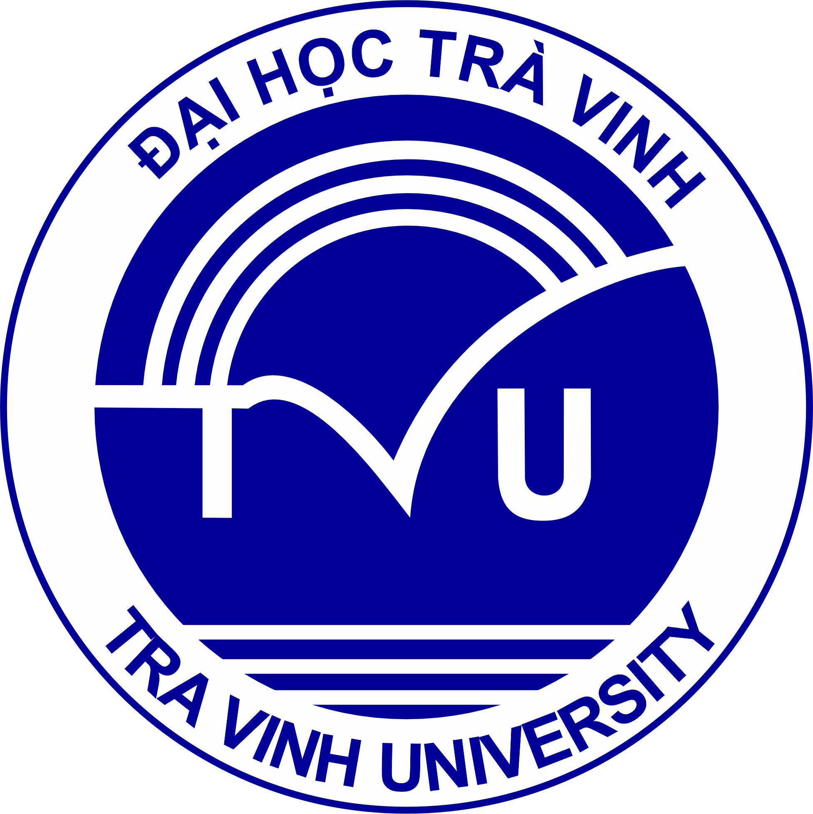
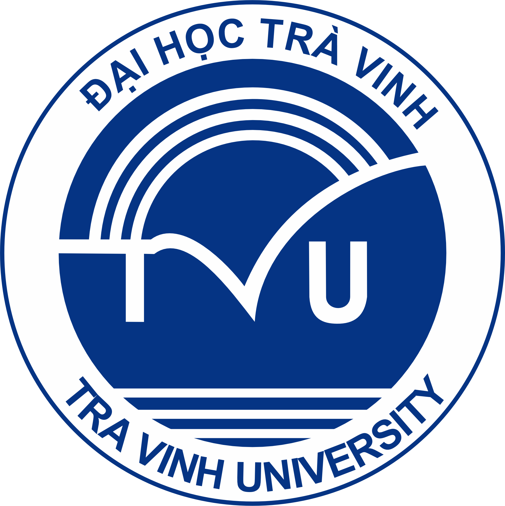
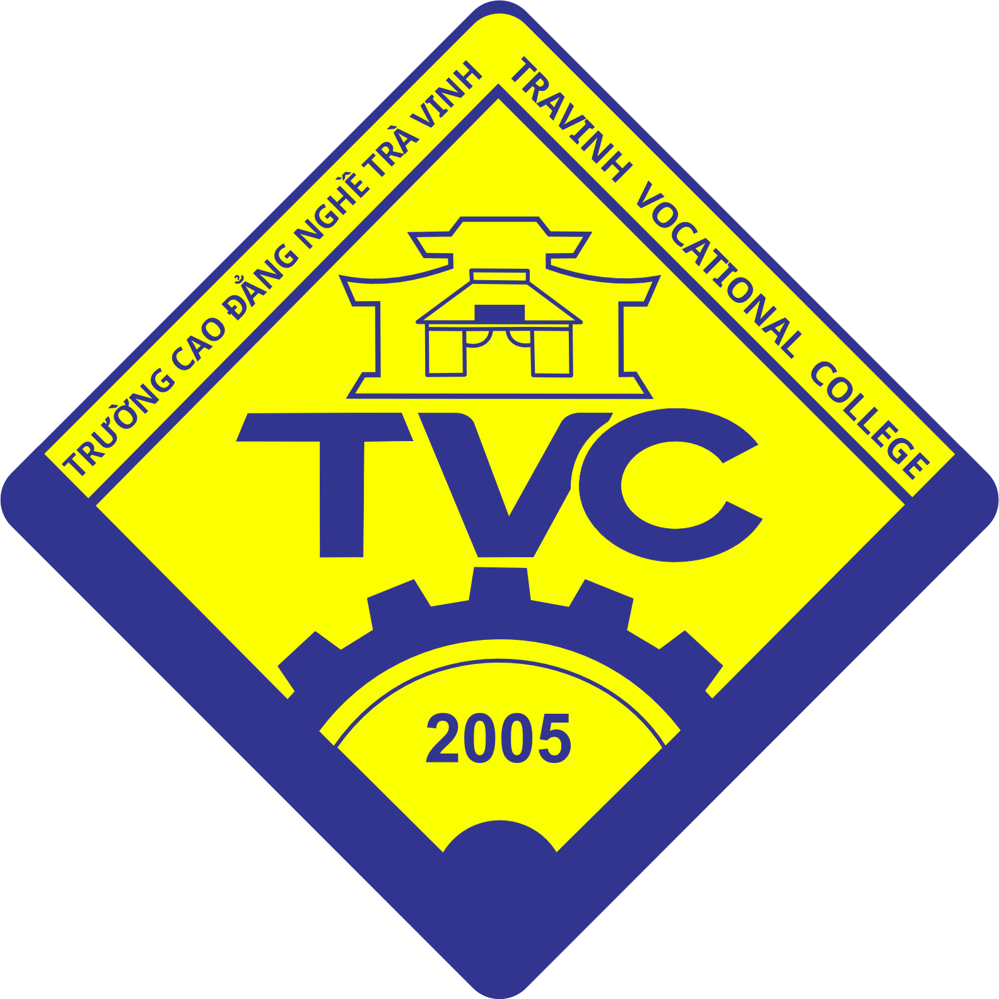

# LogoRemake

---

**Miễn trừ trách nhiệm.** Logo gốc thuộc quyền sở hữu của tổ chức tương ứng. Kho này chỉ là bản dựng lại để học tập, không phải logo chính thức.

## TVU — Đại học Trà Vinh

Hai phiên bản cùng bố cục, khác tông màu.

### Xanh chuẩn

  

| [`XanhChuan.png`](TVU/Xanhchuan/Logo-TVU_XanhChuan.png) | [`XanhChuan-LOGO.png`](TVU/Xanhchuan/Logo-TVU_XanhChuan-LOGO.png) | [`XanhChuan.pdf`](TVU/Xanhchuan/Logo-TVU_XanhChuan.pdf) |
|:---:|:---:|:---:|
| [`XanhChuan-LOGO.pdf`](TVU/Xanhchuan/Logo-TVU_XanhChuan-LOGO.pdf) | [`Logo-TVU.eps`](TVU/Xanhchuan/Logo-TVU.eps) | [`Logo-TVU.svg`](TVU/Xanhchuan/Logo-TVU.svg) |

| Hệ màu | Giá trị |
|---|---|
| HEX | `#000099` |
| RGB | `rgb(0, 0, 153)` |
| CMYK | `cmyk(100%, 100%, 0%, 40%)` |

### Xanh nhạt

  

| [`XanhNhat.png`](TVU/Xanhnhat/Logo-TVU_XanhNhat.png) | [`XanhNhat-LOGO.png`](TVU/Xanhnhat/Logo-TVU_XanhNhat-LOGO.png) | [`XanhNhat.pdf`](TVU/Xanhnhat/Logo-TVU_XanhNhat.pdf) |
|:---:|:---:|:---:|
| [`XanhNhat-LOGO.pdf`](TVU/Xanhnhat/Logo-TVU_XanhNhat-LOGO.pdf) | [`Logo-TVU.eps`](TVU/Xanhnhat/Logo-TVU.eps) | [`Logo-TVU.svg`](TVU/Xanhnhat/Logo-TVU.svg) |

| Hệ màu | Giá trị |
|---|---|
| HEX | `#053484` |
| RGB | `rgb(5, 52, 132)` |
| CMYK | `cmyk(96%, 61%, 0%, 48%)` |

## HSVVN — Hội Sinh viên Việt Nam

| [`logo.png`](HSVVN/logo.png) | [`logo.svg`](HSVVN/logo.svg) | [`logo.eps`](HSVVN/logo.eps) | [`logo-hsvvn.pdf`](HSVVN/logo-hsvvn.pdf) | [`logo-hsvvn-logo.pdf`](HSVVN/logo-hsvvn-logo.pdf) |
|:---:|:---:|:---:|:---:|:---:|

| Hệ màu | Giá trị |
|---|---|
| HEX | `#00AEED` |
| RGB | `rgb(0, 174, 237)` |
| CMYK | `cmyk(100%, 26%, 0%, 7%)` |

## TVC — Trường Cao đẳng Nghề Trà Vinh

| [`logo.png`](TVC/logo.png) | [`logo.svg`](TVC/logo.svg) | [`logo.eps`](TVC/logo.eps) | [`logo-tvc.pdf`](TVC/logo-tvc.pdf) | [`logo-tvc-logo.pdf`](TVC/logo-tvc-logo.pdf) |
|:---:|:---:|:---:|:---:|:---:|

| Hệ màu | Giá trị |
|---|---|
| Xanh dương | `rgb(50, 53, 144)` |
| Vàng | `rgb(252, 255, 0)` |

## Giấy phép

MIT — xem [`LICENSE`](LICENSE). Giấy phép này chỉ áp dụng cho bản dựng lại, không áp dụng cho logo gốc.